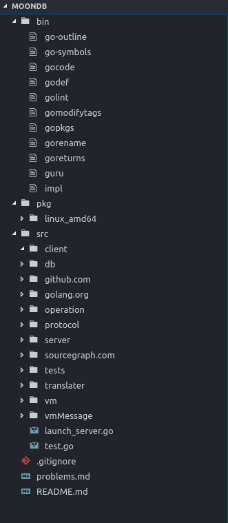

<!-- TOC -->

- [1. 根本性问题](#1-根本性问题)
    - [1.1. B+树在数据库中起到什么作用？](#11-b树在数据库中起到什么作用)
    - [1.2. 操作系统如何打开并读取一个文件？](#12-操作系统如何打开并读取一个文件)
- [2. 语言问题](#2-语言问题)
    - [2.1. golang的struct初始化问题](#21-golang的struct初始化问题)
    - [2.2. golang的工作空间设置](#22-golang的工作空间设置)
- [3. TCP/IP问题](#3-tcpip问题)
    - [3.1. 如何控制服务器对请求的响应](#31-如何控制服务器对请求的响应)

<!-- /TOC -->
# 1. 根本性问题

一些设计基本原理的问题。

## 1.1. B+树在数据库中起到什么作用？
>问题描述：   B+树在数据库中处于什么地位？具体完成什么任务？  
>参考链接：

## 1.2. 操作系统如何打开并读取一个文件？  
>问题描述：  在linux下，文件是如何被打开并读取的呢？  
>参考链接：  
    [从内核文件系统看文件读写过程](http://www.cnblogs.com/huxiao-tee/p/4657851.html)  
    [open()在Linux内核的实现](http://edsionte.com/techblog/archives/4470)  
    [read 系统调用剖析](https://www.ibm.com/developerworks/cn/linux/l-cn-read/)

* 打开  
按我的理解，”打开一个文件“这个动作由open()函数完成。可以认为，open接受的输入参数包括文件路径和读写权限。经过路径查找和权限检查后，如果成功，open会在内核中创建一个数据结构(后续会利用这个数据结构去进行读写操作)，并返回一个文件描述符(file descriptor)，用户的程序通过这个描述符去访问文件内容。  
open()的功能是**Given  a pathname for a file, open() returns a file descriptor**。主要包含的动作包括：文件路径查找，内核相关数据结构生成，文件描述符生成，文件打开(由VFS完成，涉及读cache和写buffer)。据说，路径查找是主要的步骤。
* 读取  
读取由read()完成。到这里没有什么兴趣深究下去了，猜测应该包含cache的复制、重新写入等，还是通过文件描述符去访问相应的结构。

# 2. 语言问题

一些语言相关的问题。

## 2.1. golang的struct初始化问题

我目前没有什么好的想法，也懒得去找类似构造函数的手法。我觉工厂函数正好满足需求，只不过多了几行代码而已，没什么。

## 2.2. golang的工作空间设置

每个项目都需要需要设置gopath,并且严格按照规定来组织目录结构.

vscode的默认golang配置下,会在gopath里安装各种工具.设置好gopath后,vscode会提示自动安装.这里放上我本地的目录结构截图.

参考链接:[GOPATH与工作空间](https://github.com/astaxie/build-web-application-with-golang/blob/master/zh/01.2.md)

# 3. TCP/IP问题

## 3.1. 如何控制服务器对请求的响应

包括对请求大小的限定,请求接受完毕的约定等.